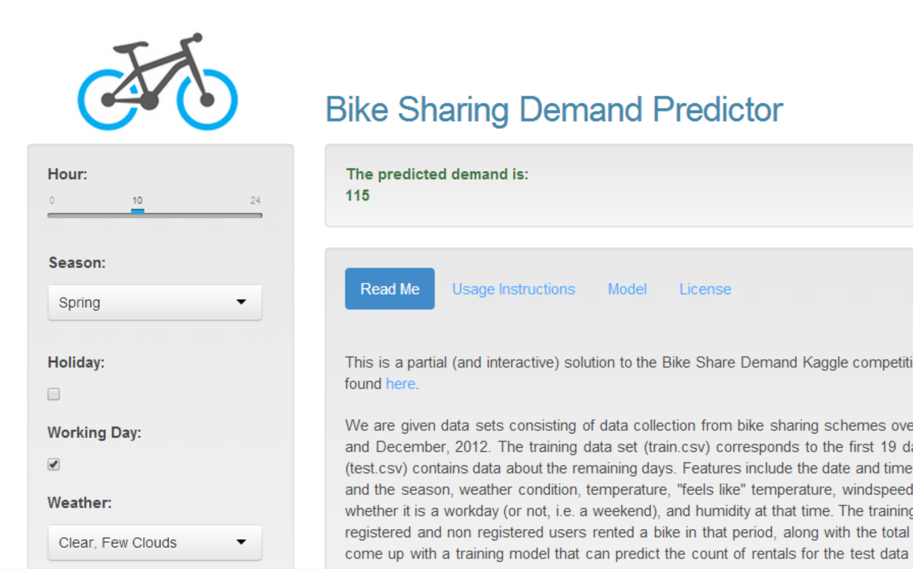

```{r echo=FALSE, results='hide'}
library(stats)
input <- read.csv('./../train.csv', 
                  colClasses = c('character', rep('integer', 4), 
                  rep('numeric', 4), rep('integer', 3)))
input$hour <- as.integer(substr(input$datetime, 12, 13))
input <- input[, -1]
input <- input[, c(12, 1:11)]
set.seed(1143)
input <- input[, -c(6, 10, 11)]

fit <- glm(count ~ ., data=input)

```

## Bike Share Demand Predictor

#### Ashic Mahtab

--- .slide #what x:-1500 y:-1500 rot:30

## What Is It?

An interactive predictor for bike share demand with near instant results.



--- .slide #how x:-1500 y:1500 rot:30

## How Does It Work?

Generalised linear model trained with *`r dim(input)[1]`* data points, and *`r dim(input)[2] - 1`* features; covering *two years*.

--- .slide #summary x:1500 y:1500 rot:30

## How Good Is It?
```{r}
summary(fit)
```

--- .slide #where x:1500 y:-1500 rot:-90

## Where Can I Find It?

App: [Shiny Apps - http://ashic.shinyapps.io/bikeshare/](http://ashic.shinyapps.io/bikeshare/)  
  
Source Code: [Github - https://github.com/ashic/bikeshare-data-product/](https://github.com/ashic/bikeshare-data-product/) 
